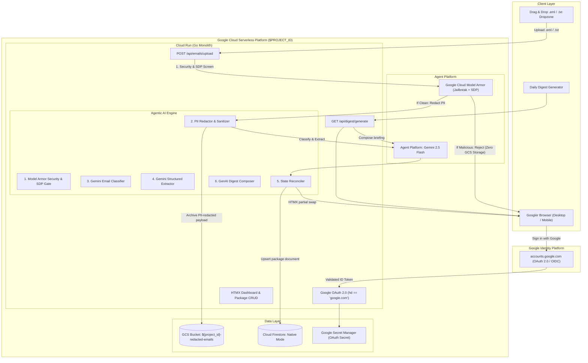

# PackagePulse 📦🤖

> **Autonomous Package Tracking & Logistics AI Agent on Google Cloud**  
> Built with Go, HTMX, Google Material Design 3, Cloud Firestore, GCS, and Agent Platform (Gemini 2.5 Flash).

[](https://golang.org)
[](https://cloud.google.com)
[](https://cloud.google.com/products/agent-platform)
[](LICENSE)

---

## 🌟 Highlights

- **Go + HTMX Monolith**: Ultra-lightweight single binary deployed on Google Distroless containers with sub-second cold starts. Zero client-side node build pipelines or complex frameworks.
- **Google Material Design 3**: Authentic Google typography, colors, and Material Web Components (`@material/web`).
- **Google Cloud Model Armor Perimeter Defense**: Inbound email payloads and queries are screened via Google Cloud Model Armor (`email-armor-guard`) to block prompt injection attacks, jailbreaks, and malicious URIs before reaching Gemini.
- **Autonomous Inbound Email Agent**: Drag & drop `.eml` or `.txt` shipping emails directly into the dashboard. Raw bytes are committed to **Google Cloud Storage (GCS)**, while **Agent Platform (Gemini 2.5 Flash)** classifies intent, extracts structured shipment metadata via strict JSON Schema, and updates Firestore.
- **Reactive UI (Zero Reloads)**: HTMX Out-of-Band (`hx-swap-oob`) reactive state synchronization updates status pill badges across lifecycle transitions without full page reloads.
- **Package State Reconciler**: Automatically identifies whether an inbound email represents a new shipment or an update to an existing package (e.g. advancing status from `Ordered` $\rightarrow$ `In Transit` $\rightarrow$ `Out for Delivery`).
- **GenAI Morning Digest**: Synthesizes bespoke, context-aware morning delivery briefings for packages arriving today, complete with tracking links, item notes, delivery reminders, and HTML sanitization defense.
- **End-to-End Observability**: OpenTelemetry standard trace exporter (`otlptracehttp`) emitting OTLP spans directly to `telemetry.googleapis.com` linked to Agent Platform (`cloud.platform: gcp.agent_engine`) and structured Cloud Logging for every security gate and pipeline tool.
- **Least-Privilege Security**: Zero admin roles. The Cloud Run service account is restricted solely to `roles/datastore.user`, `roles/aiplatform.user`, `roles/modelarmor.user`, `roles/cloudtrace.agent`, `roles/logging.logWriter`, and `roles/storage.objectUser` scoped exclusively to the application's email bucket.
- **1-Command Terraform Deployment**: Automated IaC provisions Cloud Run, Firestore Native, GCS, Secret Manager, Model Armor, and IAM bindings. Only `PROJECT_ID` is required.

---

## 🏛️ Architecture Overview



---

## 🛡️ Security, PII Redaction & Privacy Architecture

PackagePulse enforces defense-in-depth security before any data is processed or persisted:
1. **Model Armor Gatekeeper Before Storage**: Inbound emails are screened for prompt injection, jailbreak attempts, and malicious URIs before any persistence occurs. If an email is flagged as malicious, it is rejected immediately and **never stored in Google Cloud Storage**.
2. **Sensitive Data Protection (SDP) & PII Redaction Before GCS**: For clean emails, all sensitive personal data (recipient names, email addresses, phone numbers, delivery street addresses, credit card numbers, and auth tokens) is redacted using Google Cloud Model Armor's Sensitive Data Protection (SDP) and deterministic redaction before the payload is archived in Cloud Storage.
3. **Zero-PII Telemetry & Logging**: All structured JSON logs, Cloud Logging events, and OpenTelemetry trace spans are automatically sanitized to ensure no customer PII leaks into operational telemetry.

---

## 🚀 Quickstart: Deploying to Google Cloud

### Prerequisites
1. A Google Cloud Project (e.g. Argolis or standard GCP).
2. Google Cloud SDK (`gcloud`) installed and authenticated:
   ```bash
   gcloud auth login
   gcloud auth application-default login
   ```
3. Terraform (`>= 1.5.0`) installed locally.

### One-Command Deployment

Run the automated deployment script with your target Google Cloud Project ID:

```bash
./scripts/deploy.sh <YOUR_PROJECT_ID> [REGION]
```

The script will:
1. Enable all required GCP APIs (`run`, `firestore`, `aiplatform`, `storage`, `cloudbuild`, `secretmanager`, `iam`).
2. Build the container image via Google Cloud Build (no local Docker daemon required).
3. Apply Terraform infrastructure:
   - Provisions Cloud Firestore in Native mode.
   - Provisions GCS Bucket for raw email archiving.
   - Provisions dedicated least-privilege Service Account.
   - Deploys Cloud Run service with auto-scaling down to **0 instances** ($0 idle cost).
4. Outputs the live Cloud Run application URL!

### 🔑 One-Time Google OAuth Setup (~60 seconds)

1. Open the pre-scoped Google Cloud Console credentials link:
   ```text
   https://console.cloud.google.com/apis/credentials/oauthclient?project=<YOUR_PROJECT_ID>
   ```
2. Select **Application type**: `Web application`.
3. Set **Name**: `PackagePulse`.
4. Under **Authorized redirect URIs**, paste your Cloud Run URL followed by `/auth/callback`:
   ```text
   https://package-tracker-xxxx-uc.a.run.app/auth/callback
   ```
5. Click **Create**, then store your credentials:
   ```bash
   ./scripts/setup-oauth.sh <CLIENT_ID> <CLIENT_SECRET> <YOUR_PROJECT_ID>
   ```
6. Open your Cloud Run URL and click **Sign in with Google**!

---

## 💻 Local Development

You can run the application locally against your Google Cloud project using Application Default Credentials (ADC), or completely offline using the built-in in-memory fallbacks:

```bash
# Offline Mock Mode (No GCP credentials required)
export USE_MOCK_GCP=true
go run ./cmd/server
```

Open your browser at [http://localhost:8080](http://localhost:8080).

---

## 🧪 Automated Testing

The codebase includes full unit tests covering MIME parsing, tenant isolation, AI agent classification gating, and status reconciliations:

```bash
go test -v -race ./...
```

---

## 📦 Sample Test Files (Included)

Test files are provided in `static/samples/` for immediate demo evaluation:

| File | Scenario | Expected Agent Behavior |
| :--- | :--- | :--- |
| `fedex_in_transit.eml` | Real FedEx shipping notification | Screened clean by Model Armor. PII redacted before GCS storage. Classified as shipping email. Extracts tracking number `773918274619`, carrier `FedEx`, status `In Transit`. Creates new package card in dashboard. |
| `fedex_out_for_delivery.txt` | Follow-up status alert (same tracking #) | Matches existing package in Firestore. Overwrites and advances status to `Out for Delivery` in place. |
| `marketing_newsletter.eml` | Weekly promotional newsletter | Gating agent classifies as non-shipping email (`is_package_email=false`). Safely discarded with explanatory notification toast. |
| `delivery_tomorrow.eml` | Delivery tomorrow notification with Sent Date header | Deduces that the package arrives tomorrow relative to the email sent date (e.g. Sent `2026-09-06` $\rightarrow$ Delivery `2026-09-07`), updating package delivery date. |
| `prompt_injection_attack.eml` | Malicious prompt injection & jailbreak | Screened by Model Armor BEFORE any persistence. Prompt injection blocked with security alert toast and audit log. **Zero bytes written to GCS.** |

---

## 🧹 Teardown

To delete all provisioned GCP infrastructure and avoid ongoing charges:

```bash
./scripts/teardown.sh <YOUR_PROJECT_ID>
```

---

## 📄 License

Licensed under the Apache License, Version 2.0. See [LICENSE](LICENSE) for details.
