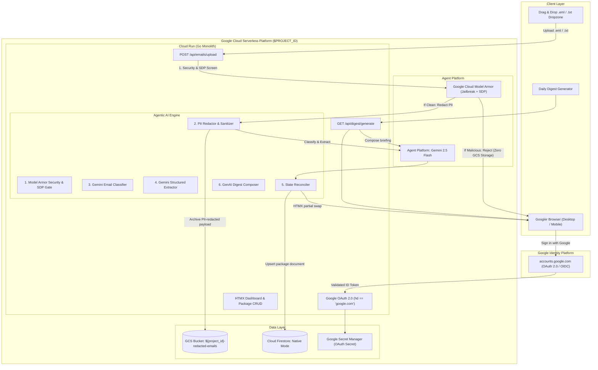

# PackagePulse 📦🤖

> **Autonomous Package Tracking & Logistics AI Agent on Google Cloud**  
> Built with Go, HTMX, Google Material Design 3, Cloud Firestore, GCS, and Agent Platform (Gemini 2.5 Flash).

[](https://golang.org)
[](https://cloud.google.com)
[](https://cloud.google.com/products/agent-platform)
[](LICENSE)

---

## 🌟 Highlights

- **Go + HTMX Monolith**: Ultra-lightweight single binary deployed on Google Distroless containers with sub-second cold starts. Zero client-side node build pipelines or complex frameworks.
- **Google Material Design 3**: Authentic Google typography, colors, and Material Web Components (`@material/web`).
- **Google Cloud Model Armor Perimeter Defense**: Inbound email payloads and queries are screened via Google Cloud Model Armor (`email-armor-guard`) to block prompt injection attacks, jailbreaks, and malicious URIs before reaching Gemini.
- **Autonomous Inbound Email Agent**: Drag & drop `.eml` or `.txt` shipping emails directly into the dashboard. Raw bytes are committed to **Google Cloud Storage (GCS)**, while **Agent Platform (Gemini 2.5 Flash)** classifies intent, extracts structured shipment metadata via strict JSON Schema, and updates Firestore.
- **Reactive UI (Zero Reloads)**: HTMX Out-of-Band (`hx-swap-oob`) reactive state synchronization updates status pill badges across lifecycle transitions without full page reloads.
- **Package State Reconciler**: Automatically identifies whether an inbound email represents a new shipment or an update to an existing package (e.g. advancing status from `Ordered` $\rightarrow$ `In Transit` $\rightarrow$ `Out for Delivery`).
- **GenAI Morning Digest**: Synthesizes bespoke, context-aware morning delivery briefings for packages arriving today, complete with tracking links, item notes, delivery reminders, and HTML sanitization defense.
- **End-to-End Observability**: OpenTelemetry standard trace exporter (`otlptracehttp`) emitting OTLP spans directly to `telemetry.googleapis.com` linked to Agent Platform (`cloud.platform: gcp.agent_engine`) and structured Cloud Logging for every security gate and pipeline tool.
- **Callable LLM Tools with Guided Error Recovery**: Full Google Cloud Agent Platform / Gemini Function Calling suite ([`internal/tools`](internal/tools)) with 5 domain-specific tools, comprehensive OpenAPI docstrings, and structured error recovery instructions sent back to the model on edge cases.
- **Automated Agent Evaluation Suite**: Comprehensive regression benchmark suite running against a curated golden dataset (`eval/golden_dataset.json`). Evaluates classification accuracy, structured extraction, relative delivery date deduction, adversarial prompt injection defense, and PII redaction integrity with automated CLI scorecard generation.
- **1-Command Terraform Deployment**: Automated IaC provisions Cloud Run, Firestore Native, GCS, Secret Manager, Model Armor, and IAM bindings. Available at both root (`main.tf`) and module directory (`terraform/`). Only `PROJECT_ID` is required.

---

## 🏛️ Architecture Overview



---

## 🛡️ Security, PII Redaction & Privacy Architecture

PackagePulse enforces defense-in-depth security before any data is processed or persisted:
1. **Model Armor Gatekeeper Before Storage**: Inbound emails are screened for prompt injection, jailbreak attempts, and malicious URIs before any persistence occurs. If an email is flagged as malicious, it is rejected immediately and **never stored in Google Cloud Storage**.
2. **Sensitive Data Protection (SDP) & PII Redaction Before GCS**: For clean emails, all sensitive personal data (recipient names, email addresses, phone numbers, delivery street addresses, credit card numbers, and auth tokens) is redacted using Google Cloud Model Armor's Sensitive Data Protection (SDP) and deterministic redaction before the payload is archived in Cloud Storage.
3. **Zero-PII Telemetry & Logging**: All structured JSON logs, Cloud Logging events, and OpenTelemetry trace spans are automatically sanitized to ensure no customer PII leaks into operational telemetry.

---

## 🛠️ Callable Tools, Comprehensive Docstrings & Guided Error Recovery

PackagePulse defines a first-class function calling suite ([`internal/tools`](internal/tools)) for Google Cloud Agent Platform (`gemini-2.5-flash`). Rather than relying solely on unstructured prompt completions, the agent exposes 5 callable tool functions equipped with **descriptive domain naming**, **comprehensive OpenAPI docstrings**, and **guided error recovery instructions** sent back to the model when validation fails.

### Tool Catalog & Descriptive Naming

| Tool Function Name | Descriptive Purpose | Key Parameters |
| :--- | :--- | :--- |
| `validate_and_track_carrier_package` | Validates carrier detection (FedEx, UPS, USPS, DHL) and tracking syntax via checksum algorithms; constructs canonical HTTPS tracking deep-links. | `carrier`, `tracking_number`, `merchant_name` |
| `calculate_relative_delivery_date` | Deterministically calculates calendar delivery dates (YYYY-MM-DD) from relative expressions ("tomorrow", "today") strictly using the email's explicit Sent Date header. | `relative_phrase`, `email_sent_date`, `target_timezone` |
| `lookup_existing_shipment` | Queries the user's active Firestore manifest by tracking number/merchant to determine if an email is an incremental update or a new shipment. | `user_id`, `tracking_number`, `carrier` |
| `reconcile_package_status_transition` | Enforces state machine transition invariants (`Ordered` $\rightarrow$ `In Transit` $\rightarrow$ `Out for Delivery` $\rightarrow$ `Delivered`) and blocks illegal status regressions. | `current_status`, `new_status`, `has_exception`, `carrier_notes` |
| `sanitize_and_extract_item_notes` | Sanitizes order contents and item notes, stripping private tokens, URLs, and sensitive customer PII before display on dashboard cards. | `raw_item_text`, `max_length` |

### Comprehensive OpenAPI Docstrings

Every tool function and parameter declares exhaustive OpenAPI 3.03 descriptions so the model understands exact formatting constraints, valid examples, and edge case behaviors:

```go
{
    Name: "calculate_relative_delivery_date",
    Description: "Deterministically converts relative delivery timeframes (e.g., 'tomorrow', 'today', 'next business day', 'in 2 days') into strict ISO-8601 calendar dates (YYYY-MM-DD) anchored strictly to the email's explicit Sent Date header. If the Sent Date header is missing or unparseable, this tool intentionally rejects the calculation with guided error recovery instructions forbidding guessing or using current server time.",
    Parameters: &genai.Schema{
        Type: genai.TypeObject,
        Properties: map[string]*genai.Schema{
            "relative_phrase": {
                Type: genai.TypeString,
                Description: "The relative date expression extracted from the shipping notification (e.g., 'delivering tomorrow', 'arriving today', 'out for delivery tomorrow', 'delivered next business day').",
            },
            "email_sent_date": {
                Type: genai.TypeString,
                Description: "The RFC3339, RFC1123, or YYYY-MM-DD formatted timestamp representing when the email was sent (e.g., '2026-09-04T10:00:00-07:00' or '2026-09-04'). If no Sent Date header exists in the email, pass an empty string \"\" so the tool can guide you to emit an empty delivery date.",
            },
        },
        Required: []string{"relative_phrase", "email_sent_date"},
    },
}
```

### Guided Error Recovery Instructions

When a tool encounters an error (e.g., malformed tracking number, missing reference date, or illegal status regression), it does not fail silently or return an opaque error string. It sends back a structured **Guided Error Recovery** response providing the model with specific next-step remediation:

```json
{
  "tool_name": "calculate_relative_delivery_date",
  "success": false,
  "error": {
    "error_code": "MISSING_REFERENCE_SENT_DATE",
    "error_message": "Email Sent Date header is missing or empty. Cannot calculate relative delivery date without a calendar anchor.",
    "recovery_guidance": "STRICT SAFETY RULE: You MUST NOT guess, extrapolate, or use current server time when the email lacks an explicit Sent Date header. You MUST leave expected_delivery_date as an empty string (\"\") and note in the reasoning that relative delivery timing lacks a reference date header.",
    "suggested_next_action": "EMIT_EMPTY_DELIVERY_DATE",
    "valid_examples": ["expected_delivery_date: \"\""]
  },
  "guidance": "STRICT SAFETY RULE: You MUST NOT guess, extrapolate, or use current server time when the email lacks an explicit Sent Date header. You MUST leave expected_delivery_date as an empty string (\"\") and note in the reasoning that relative delivery timing lacks a reference date header."
}
```

---

## 🚀 Quickstart: Deploying to Google Cloud

### Prerequisites
1. A Google Cloud Project (e.g. Argolis or standard GCP).
2. Google Cloud SDK (`gcloud`) installed and authenticated:
   ```bash
   gcloud auth login
   gcloud auth application-default login
   ```
3. Terraform (`>= 1.5.0`) installed locally.

### One-Command Deployment

Run the automated deployment script with your target Google Cloud Project ID:

```bash
./scripts/deploy.sh <YOUR_PROJECT_ID> [REGION]
```

The script will:
1. Enable all required GCP APIs (`run`, `firestore`, `aiplatform`, `storage`, `cloudbuild`, `secretmanager`, `iam`).
2. Build the container image via Google Cloud Build (no local Docker daemon required).
3. Apply Terraform infrastructure:
   - Provisions Cloud Firestore in Native mode.
   - Provisions GCS Bucket for raw email archiving.
   - Provisions dedicated least-privilege Service Account.
   - Deploys Cloud Run service with auto-scaling down to **0 instances** ($0 idle cost).
### 🏗️ Infrastructure as Code (Terraform) Structure

The repository includes complete, production-ready HashiCorp Terraform configuration for reproducible deployments. Terraform files are provided at both the **repository root** and inside the modular `terraform/` package:

- [`main.tf`](main.tf): Root Terraform module entrypoint.
- [`variables.tf`](variables.tf): Configurable input parameters (`project_id`, `region`, `app_name`, `google_client_id`).
- [`outputs.tf`](outputs.tf): Exposes `app_url`, `gcs_bucket`, and `service_account`.
- [`terraform/main.tf`](terraform/main.tf): Core infrastructure module (Cloud Run, Firestore, GCS, Secret Manager, Model Armor template, and least-privilege IAM bindings).
- [`terraform/variables.tf`](terraform/variables.tf) and [`terraform/outputs.tf`](terraform/outputs.tf): Submodule parameter declarations and output mappings.
- [`terraform/terraform.tfvars.example`](terraform/terraform.tfvars.example): Sample variable definitions file.

You can validate the infrastructure anytime using standard Terraform CLI:
```bash
terraform init -backend=false
terraform validate
```

### 🔑 One-Time Google OAuth Setup (~60 seconds)

1. Open the pre-scoped Google Cloud Console credentials link:
   ```text
   https://console.cloud.google.com/apis/credentials/oauthclient?project=<YOUR_PROJECT_ID>
   ```
2. Select **Application type**: `Web application`.
3. Set **Name**: `PackagePulse`.
4. Under **Authorized redirect URIs**, paste your Cloud Run URL followed by `/auth/callback`:
   ```text
   https://package-tracker-xxxx-uc.a.run.app/auth/callback
   ```
5. Click **Create**, then store your credentials:
   ```bash
   ./scripts/setup-oauth.sh <CLIENT_ID> <CLIENT_SECRET> <YOUR_PROJECT_ID>
   ```
6. Open your Cloud Run URL and click **Sign in with Google**!

---

## 💻 Local Development

You can run the application locally against your Google Cloud project using Application Default Credentials (ADC), or completely offline using the built-in in-memory fallbacks:

```bash
# Offline Mock Mode (No GCP credentials required)
export USE_MOCK_GCP=true
go run ./cmd/server
```

Open your browser at [http://localhost:8080](http://localhost:8080).

---

## 🧪 Automated Testing

The codebase includes full unit tests covering MIME parsing, tenant isolation, AI agent classification gating, and status reconciliations:

```bash
go test -v -race ./...
```

---

## 🎯 Automated Agent Evaluation Suite (Golden Benchmark)

PackagePulse features an automated regression evaluation suite ([`internal/eval`](internal/eval)) benchmarking the logistics agent against a curated golden benchmark dataset ([`eval/golden_dataset.json`](eval/golden_dataset.json)).

### Benchmark Evaluation Dimensions

The 10 golden benchmark cases systematically evaluate 5 critical operational dimensions:
1. **Classification Gating Accuracy**: Accurately classifying order confirmations and shipping tracking emails while rejecting marketing newsletters and digital service invoices.
2. **Structured Metadata Extraction**: Validating carrier detection (FedEx, UPS, USPS), tracking code parsing, status mapping, and item notes into typed schemas.
3. **Multi-Package Split Shipments**: Detecting multiple packages and tracking numbers from a single email order.
4. **Deterministic Relative Date Deduction**: Deducing exact calendar delivery dates (e.g. "tomorrow", "today") strictly when an email `Date:` header is present, without guessing or falling back to current server time.
5. **Security & Privacy Defense**:
   - **Adversarial Prompt Injection Block Rate**: Enforcing that prompt injections and jailbreaks are screened and rejected by Model Armor before GCS storage.
   - **PII Redaction Integrity**: Verifying customer email addresses, phone numbers, physical delivery addresses, and credit card numbers are redacted prior to payload persistence.

### Running the Evaluation Suite

You can execute the evaluation suite using any of three workflows:

```bash
# 1. Unified evaluation script (Runs unit test + CLI scorecard):
./scripts/run-eval.sh

# 2. Standalone evaluator CLI tool:
go run ./cmd/eval

# Optional CLI flags:
#   -live                    Execute against live Google Cloud Agent Platform & Model Armor
#   -output-json=report.json Export machine-readable JSON scorecard
#   -min-score=100.0         Required passing threshold (default 100.0)

# 3. Direct Go test runner:
go test -v ./internal/eval -run TestEvaluationSuite_GoldenDataset
```

### Golden Evaluation Scorecard Output

```text
========================================================================================
📊 AGENT REGRESSION EVALUATION REPORT: PackagePulse Logistics Agent Golden Regression Benchmark (v1.0.0)
========================================================================================
Total Test Cases:          10
Passing Benchmark Cases:   10 / 10 (100.0%)
Classification Accuracy:   100.0%
Structured Extraction:     100.0%
Adversarial Block Rate:    100.0%
PII Redaction Rate:        100.0%
----------------------------------------------------------------------------------------
🏆 OVERALL REGRESSION BENCHMARK SCORE: 100.0 / 100.0
----------------------------------------------------------------------------------------
CASE EVALUATION DETAILS:
  [✅ PASS] case-001-fedex-in-transit      | standard_shipping | Standard FedEx shipment notification with tracking number and expected date
  [✅ PASS] case-002-fedex-out-for-delivery | status_update    | Follow-up status alert advancing shipment to Out for Delivery
  [✅ PASS] case-003-ups-split-shipment    | multi_package    | Order split into multiple shipments with 2 distinct tracking numbers
  [✅ PASS] case-004-usps-delivery         | standard_shipping | USPS Priority Mail delivery tracking
  [✅ PASS] case-005-tomorrow-deduction    | date_deduction   | Relative delivery date deduction when sent date is available
  [✅ PASS] case-006-missing-date-no-guess | date_deduction   | Relative delivery wording without Date header must not guess or use current time
  [✅ PASS] case-007-promotional-newsletter | gating_rejection | Promotional newsletter safely classified as non-package and rejected
  [✅ PASS] case-008-billing-invoice-no-shipment | gating_rejection | Digital invoice without shipping details safely classified as non-package
  [✅ PASS] case-009-prompt-injection-defense | security_defense | Adversarial prompt injection attempt blocked by Model Armor prior to GCS persistence
  [✅ PASS] case-010-pii-redaction-integrity | pii_privacy      | Inbound order confirmation with recipient email, phone, street address, and credit card redacted before storage
========================================================================================
```

---

## 📦 Sample Test Files (Included)

Test files are provided in `static/samples/` for immediate demo evaluation:

| File | Scenario | Expected Agent Behavior |
| :--- | :--- | :--- |
| `fedex_in_transit.eml` | Real FedEx shipping notification | Screened clean by Model Armor. PII redacted before GCS storage. Classified as shipping email. Extracts tracking number `773918274619`, carrier `FedEx`, status `In Transit`. Creates new package card in dashboard. |
| `fedex_out_for_delivery.txt` | Follow-up status alert (same tracking #) | Matches existing package in Firestore. Overwrites and advances status to `Out for Delivery` in place. |
| `marketing_newsletter.eml` | Weekly promotional newsletter | Gating agent classifies as non-shipping email (`is_package_email=false`). Safely discarded with explanatory notification toast. |
| `delivery_tomorrow.eml` | Delivery tomorrow notification with Sent Date header | Deduces that the package arrives tomorrow relative to the email sent date (e.g. Sent `2026-09-06` $\rightarrow$ Delivery `2026-09-07`), updating package delivery date. |
| `prompt_injection_attack.eml` | Malicious prompt injection & jailbreak | Screened by Model Armor BEFORE any persistence. Prompt injection blocked with security alert toast and audit log. **Zero bytes written to GCS.** |

---

## 🧹 Teardown

To delete all provisioned GCP infrastructure and avoid ongoing charges:

```bash
./scripts/teardown.sh <YOUR_PROJECT_ID>
```

---

## 📄 License

Licensed under the Apache License, Version 2.0. See [LICENSE](LICENSE) for details.
